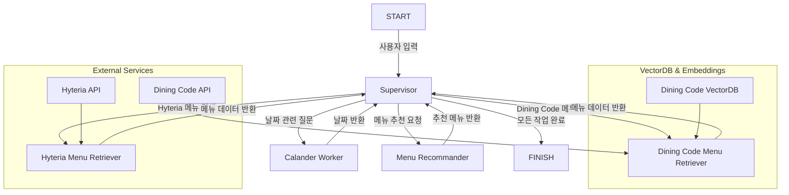

# 🍽️ TWA: Today What's menu Agent

## 📌 프로젝트 개요
본 프로젝트는 사용자의 음식 관련 질문을 이해하고, 적절한 식당 및 메뉴를 추천하는 AI 기반 챗봇 서비스입니다. 내부 구내식당(Hyteria) 및 외부 식당(Dining Code)의 데이터를 활용하여 메뉴를 검색하고 추천하는 기능을 제공합니다.

## 🚀 주요 기능
### ✅ Supervisor 기반 요청 라우팅
- 사용자 입력을 분석하여 적절한 워커(Worker)에게 작업을 전달
- **Calander Worker**: 날짜 정보 처리
- **Hyteria Menu Retriever**: Hyteria(구내식당) 메뉴 검색
- **Dining Code Menu Retriever**: 외부 식당 메뉴 검색
- **Menu Recommander**: 사용자 취향을 고려한 맞춤 메뉴 추천

### ✅ 벡터 DB 및 Embedding 활용
- **FAISS VectorDB**를 사용하여 식당 및 메뉴 데이터를 저장 및 검색
- **Azure OpenAI Embeddings**로 텍스트 기반 유사도 검색 수행

### ✅ 외부 API 연동
- **Hyteria API**: 구내식당의 최신 메뉴 데이터를 가져옴
- **Dining Code API**: 외부 식당의 상세 정보를 조회하여 제공

## 🛠️ 기술 스택
- **Backend**: FastAPI, LangChain, LangGraph
- **Vector Search**: FAISS
- **LLM**: Azure OpenAI GPT-4o-mini, o3-mini
- **Infra**: Docker, Azure Cloud

## 🔄 시스템 아키텍처

## 📌 API 엔드포인트
| Method | Endpoint | 설명 |
|--------|---------|------|
| POST | `/prompt?user_id=""&query=""` | 질의 |
## 📬 문의 및 기여
프로젝트 개선을 위한 기여는 언제든 환영합니다! PR 및 Issue를 통해 의견을 남겨주세요. 😊

